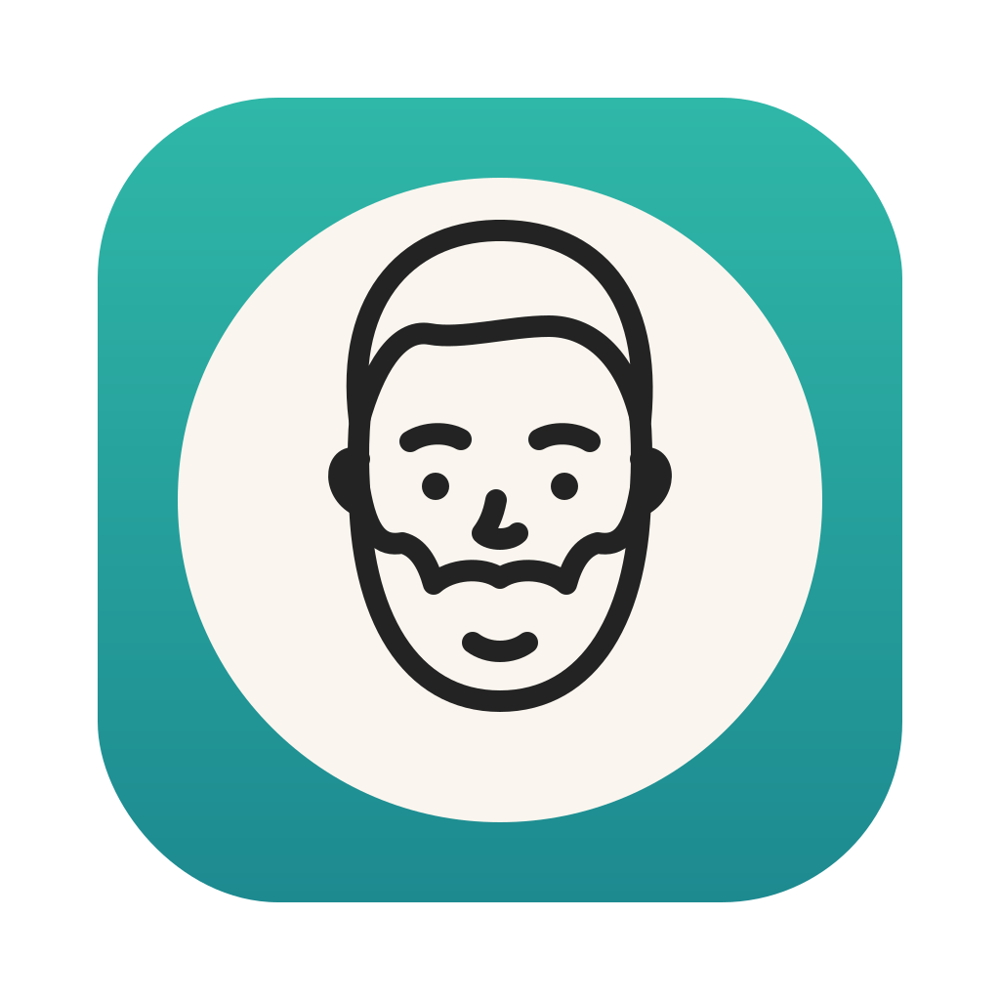

<p align="center">
  
</p>

# FaceFloat

**A floating, always-on-top webcam overlay for macOS with real-time ML background removal — built natively in Swift with zero dependencies.**


Put your face on screen while you record, present, or demo — in a clean circle or
rectangle that floats above every app and Space. Flip on **Cutout** mode and
machine-learning person segmentation removes the background entirely, so you float
directly over your desktop.

<!-- TODO: record a short demo (Cutout mode over a desktop is the money shot)
     and embed it here:   -->

Inspired by [FaceScreen](https://facescreenapp.com/); built from scratch as a
native-macOS engineering exercise.

## Features

- 🪟 **Borderless floating window** — always on top, follows you across Spaces and
  full-screen apps; drag anywhere to move, drag edges to resize
- ⭕ **Circle or rectangle** — circle stays aspect-locked through resizes,
  enforced by the window server
- ✂️ **Cutout mode** — Vision person segmentation makes the background fully
  transparent in real time
- 🌫️ **Blur mode** — portrait-style background blur
- 🎚️ **Edge quality toggle** — trade mask sharpness against motion latency
- 📷 Camera picker (built-in / external / Continuity Camera), mirror toggle,
  size presets, hot-unplug fallback
- 🖱️ Controls in both a menu bar icon and the window's right-click menu
- 💾 Every setting and the window frame persist across launches

## Quick start

```sh
git clone https://github.com/JoelCodes/face-float.git
cd face-float
./scripts/make-app.sh --install   # builds, installs to /Applications, launches
```

Requires macOS 14+ and the Xcode Command Line Tools. Approve the camera
permission on first launch. The app is menu-bar only (no Dock icon) — look for
the camera icon near your clock.

## How it works

```
AVCaptureSession ──► FrameProcessor ──────────────► VideoView (MTKView)
   camera frames        │        ▲                     Metal + CIContext
   (BGRA, 720p)         │        │ latest mask         transparent layer,
                        ▼        │                     cornerRadius shape
                 Vision person segmentation
                 (async, own queue, .accurate)
```

The interesting engineering is in keeping this smooth at full frame rate:

- **Asynchronous segmentation.** Apple's `.accurate` person-segmentation model is
  too slow to run per-frame, so masks are computed on a dedicated queue at their
  own pace while video renders at full rate using the latest completed mask —
  near-system-quality edges without sacrificing frame rate.
- **Temporal mask smoothing.** Raw per-frame masks jitter at the person/background
  boundary. Each mask is blended with its predecessor (an exponential moving
  average) and edge-softened, then *materialized* to concrete pixels — deliberately
  breaking Core Image's lazy evaluation so the filter graph can't grow unboundedly
  frame over frame.
- **Zero-copy GPU pipeline.** Camera buffers are wrapped, composited
  (`CIBlendWithMask` over a clear or Gaussian-blurred background), and rendered
  into the Metal drawable without pixel data ever leaving the GPU; the CPU only
  shuttles filter recipes.
- **True window transparency.** The Metal layer clears to transparent alpha each
  frame, so cutout mode composites your camera feed directly over whatever is
  behind the window.

## Architecture

Single-responsibility components wired together by a thin app delegate
([design doc](docs/plans/2026-07-18-facefloat-design.md)):

| Component | Role |
|---|---|
| `CameraManager` | `AVCaptureSession` lifecycle, device discovery, hot-unplug fallback |
| `FrameProcessor` | Vision segmentation + Core Image compositing (pure logic, UI-free) |
| `VideoView` | `MTKView` rendering with aspect-fill crop and shape masking |
| `OverlayWindow` | Borderless transparent floating window behavior |
| `AppDelegate` | Composition root; builds both menus from one shared builder |
| `Settings` | Typed `UserDefaults` wrapper |

No third-party dependencies — capture, ML, compositing, and rendering all come
from OS frameworks. Builds with Swift Package Manager; a 20-line script assembles
the `.app` bundle.

## Roadmap

- First-run onboarding
- Global show/hide keyboard shortcut
- Developer ID signing + notarization for public distribution
- Universal (Intel + Apple Silicon) build

## License

[MIT](LICENSE)
